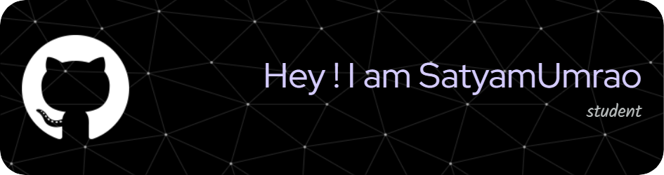

# 👋 Hey there!

## 💫 About Me

🚀 **BCA Student | Full-Stack Developer in Progress**  
💻 **Stack:** JavaScript, React, Python, C/C++  
🌐 **Interests:** Web Development, Backend Systems, Clean UI  
🧠 **Learning:** AI/ML Fundamentals, APIs, Databases, System Design  

🔧 Actively working on full-stack projects using modern tools and workflows  
📈 Improving problem-solving skills through real-world challenges and coding practice  
🤝 Open to internships, collaborations, and open-source contributions  

🌱 Passionate about building meaningful software and growing every day.

## 💻 Tech Stack

  

## 🐍 Contributions

<picture>
  <source media="(prefers-color-scheme: dark)" srcset="https://raw.githubusercontent.com/satyam-umrao/satyam-umrao/output/github-contribution-grid-snake-dark.svg">
  <source media="(prefers-color-scheme: light)" srcset="https://raw.githubusercontent.com/satyam-umrao/satyam-umrao/output/github-contribution-grid-snake.svg">
  
</picture>

## 🌐 Connect with Me

  
  &nbsp;&nbsp;
  
  &nbsp;&nbsp;
  
  &nbsp;&nbsp;
  
  &nbsp;&nbsp;
  
  &nbsp;&nbsp;
  
  &nbsp;&nbsp;
  

⭐ *“Code. Learn. Build. Repeat.”*
